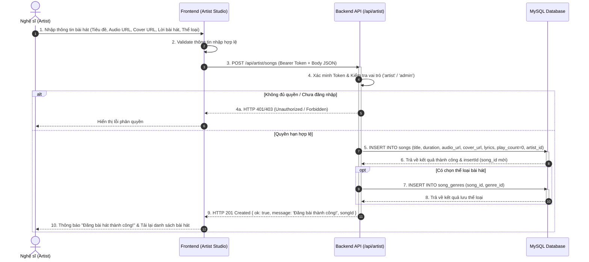
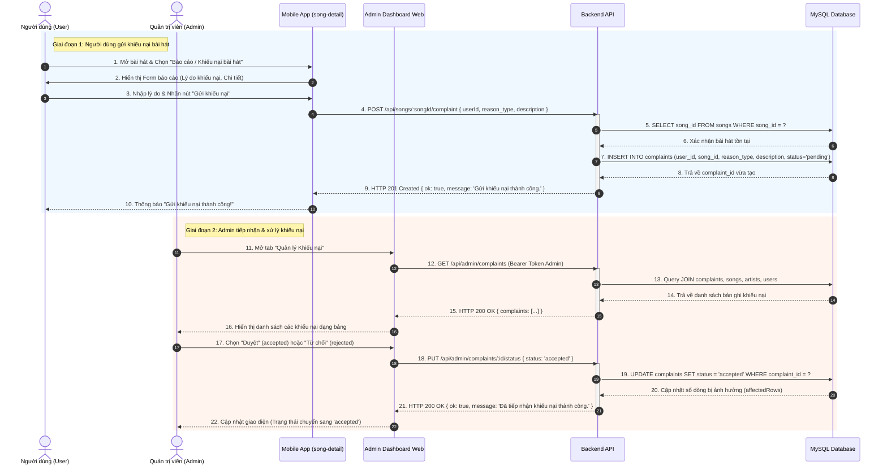
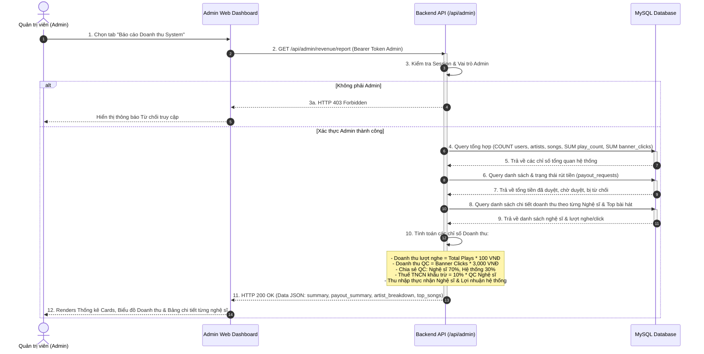

# Biểu đồ Tuần tự (Sequence Diagrams) cho 3 Use Case Cốt lõi

Tài liệu này tổng hợp **Biểu đồ Tuần tự (Sequence Diagrams)** sử dụng cú pháp [Mermaid](https://mermaid.js.org/) cho 3 Use Case chính được xây dựng trong hệ thống ứng dụng **BTL_Mobile2 (Ứng dụng Âm nhạc & Admin Studio)**.

---

## 1. Use Case 1: Đăng bài hát mới (Artist Studio - Song Upload)

### Mô tả
Nghệ sĩ đăng tải bài hát mới vào hệ thống thông qua giao diện **Artist Studio**. Hệ thống kiểm tra quyền hạn, ghi nhận thông tin file âm thanh, ảnh bìa, lời bài hát, và liên kết bài hát với thể loại tương ứng vào MySQL Database.

### Sequence Diagram

### Thành phần & Luồng xử lý chi tiết
- **Actor**: Nghệ sĩ (Artist).
- **API Endpoint**: `POST /api/artist/songs`.
- **Dữ liệu truyền vào**: `title`, `duration`, `audio_url`, `cover_url`, `lyrics`, `genres`, `album_id`.
- **Bảng DB liên quan**: `artists`, `songs`, `song_genres`.

---

## 2. Use Case 2: Gửi và Xử lý Khiếu nại Bài hát (Song Complaint System)

### Mô tả
Người dùng báo cáo/khiếu nại vi phạm bản quyền hoặc nội dung không phù hợp của một bài hát từ trang chi tiết bài hát (`song-detail`). Quản trị viên (Admin) xem danh sách khiếu nại trên **Admin Dashboard** và thực hiện **Duyệt (Accept)** hoặc **Từ chối (Reject)** khiếu nại.

### Sequence Diagram

### Thành phần & Luồng xử lý chi tiết
- **Actors**: Người dùng (User), Quản trị viên (Admin).
- **API Endpoints**: 
  - `POST /api/songs/:songId/complaint` (Người dùng gửi)
  - `GET /api/admin/complaints` (Admin lấy danh sách)
  - `PUT /api/admin/complaints/:id/status` (Admin cập nhật trạng thái)
- **Bảng DB liên quan**: `complaints`, `songs`, `artists`, `users`.

---

## 3. Use Case 3: Xem Thống kê & Báo cáo Doanh thu Hệ thống (Admin Revenue Reporting)

### Mô tả
Quản trị viên (Admin) truy cập **Báo cáo Doanh thu** trên **Admin Dashboard** để xem tổng hợp thu nhập của toàn bộ hệ thống (doanh thu từ lượt nghe nhạc, lượt click banner quảng cáo), doanh thu chia sẻ 70/30 với Nghệ sĩ, khấu trừ thuế TNCN (10%), và quản lý các yêu cầu rút tiền.

### Sequence Diagram

### Thành phần & Luồng xử lý chi tiết
- **Actor**: Quản trị viên (Admin).
- **API Endpoint**: `GET /api/admin/revenue/report`.
- **Thuật toán tính toán chính**:
  - `Song Play Revenue = Total Plays * 100 VNĐ`
  - `Ad Banner Revenue = Banner Clicks * 3,000 VNĐ`
  - `Artist Ad Share (Gross) = Ad Revenue * 70%`
  - `Platform Ad Share = Ad Revenue * 30%`
  - `PIT Tax Withheld = Artist Ad Share * 10%`
  - `Artist Net Earnings = (Artist Ad Share - PIT Tax) + Song Play Revenue`
- **Bảng DB liên quan**: `users`, `artists`, `songs`, `payout_requests`.
