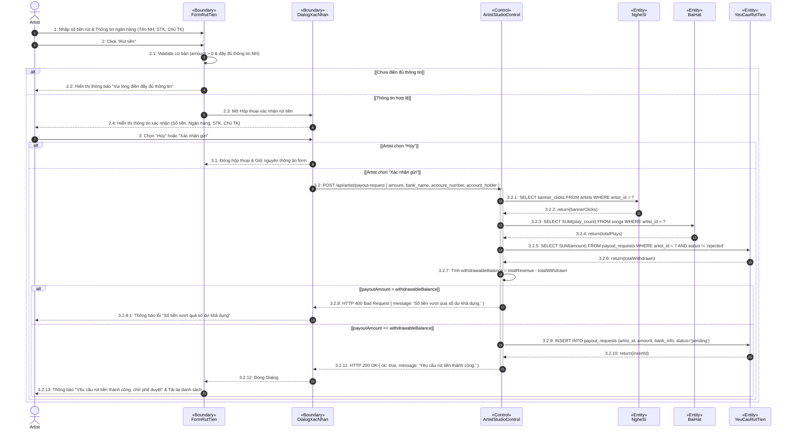
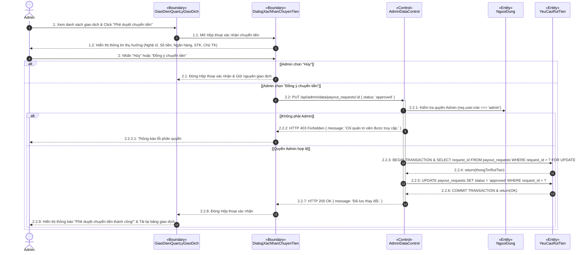

# Biểu đồ Tuần tự (Sequence Diagrams) Chuẩn Visual Paradigm có Bước Xác Nhận (Confirmation Modal)

Đặc tả các Use Case **Rút tiền** và **Phê duyệt chuyển tiền** bổ sung **bước xác nhận (Confirmation Dialog)** trước khi chính thức gửi hoặc duyệt giao dịch.

---

## 1. Use Case: Gửi yêu cầu rút tiền (Actor: Artist)

Bổ sung **Dialog Xác nhận rút tiền** (hiển thị số tiền & thông tin tài khoản ngân hàng thụ hưởng trước khi tạo yêu cầu).

- **Actor**: `Artist`
- **Boundaries**: 
  - `FormRutTien` (Form rút tiền trong Artist Studio)
  - `DialogXacNhan` (Hộp thoại xác nhận thông tin rút tiền)
- **Control**: `ArtistStudioControl`
- **Entities**: `NgheSi`, `BaiHat`, `YeuCauRutTien`

---

## 2. Use Case: Xử lý / Phê duyệt chuyển tiền (Actor: Admin)

Bổ sung **Dialog Xác nhận phê duyệt thanh toán chuyển tiền** (Hiển thị chi tiết Tên chủ tài khoản, Số tài khoản, Ngân hàng thụ hưởng & Số tiền trước khi Admin phê duyệt).

- **Actor**: `Admin` (Quản trị viên)
- **Boundaries**: 
  - `GiaoDienQuanLyGiaoDich` (Trang quản lý giao dịch Admin Web)
  - `DialogXacNhanChuyenTien` (Popup xác nhận phê duyệt chuyển tiền)
- **Control**: `AdminDataControl`
- **Entities**: `NguoiDung`, `YeuCauRutTien`

