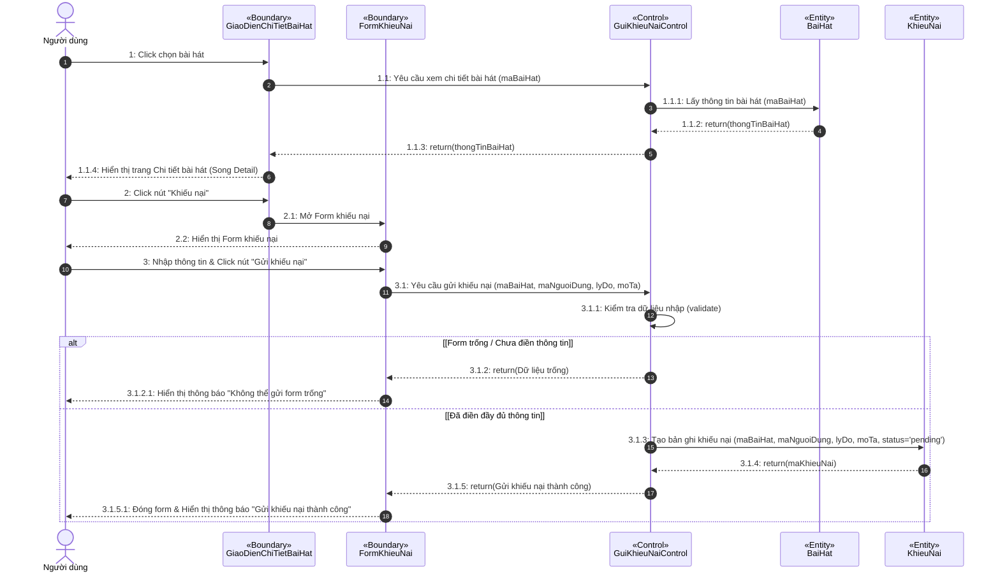
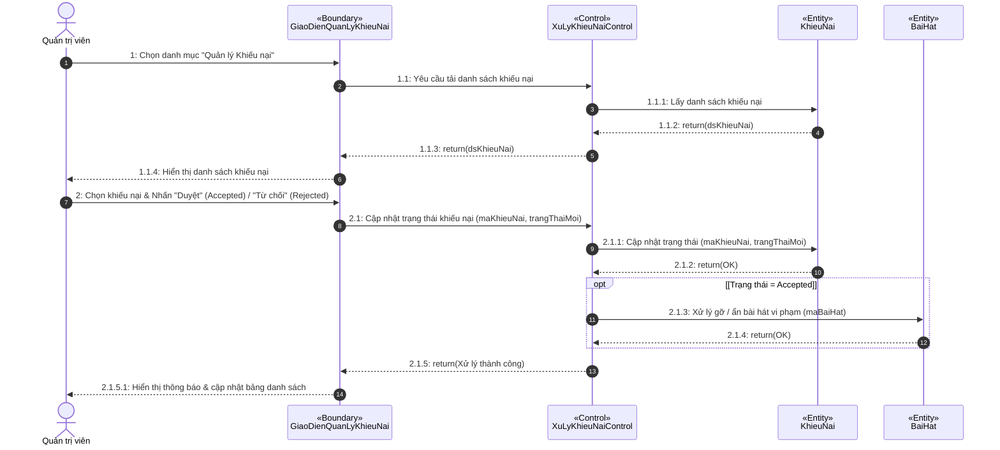
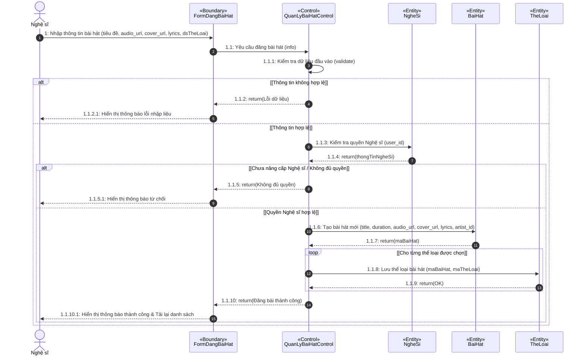

# Biểu đồ Tuần tự (Sequence Diagrams) Chuẩn Visual Paradigm (1 Actor / 1 Use Case)

Đặc tả các Use Case theo kiến trúc 3 lớp **Boundary - Control - Entity** và đánh số thông điệp chuẩn Visual Paradigm (1, 1.1, 1.1.1, 1.1.2: return...).

---

## 1. Use Case: Gửi khiếu nại bài hát (Người dùng)

- **Actor**: `Người dùng`
- **Boundaries**: 
  - `GiaoDienChiTietBaiHat` (Trang chi tiết bài hát - Song Detail)
  - `FormKhieuNai` (Modal / Form nhập nội dung khiếu nại)
- **Control**: `GuiKhieuNaiControl`
- **Entities**: `BaiHat`, `KhieuNai`

---

## 2. Use Case: Xử lý khiếu nại bài hát (Quản trị viên)

- **Actor**: `Quản trị viên` (Admin)
- **Boundary**: `GiaoDienQuanLyKhieuNai`
- **Control**: `XuLyKhieuNaiControl`
- **Entities**: `KhieuNai`, `BaiHat`

---

## 3. Use Case: Đăng bài hát mới (Nghệ sĩ)

- **Actor**: `Nghệ sĩ`
- **Boundary**: `FormDangBaiHat`
- **Control**: `QuanLyBaiHatControl`
- **Entities**: `NgheSi`, `BaiHat`, `TheLoai`

